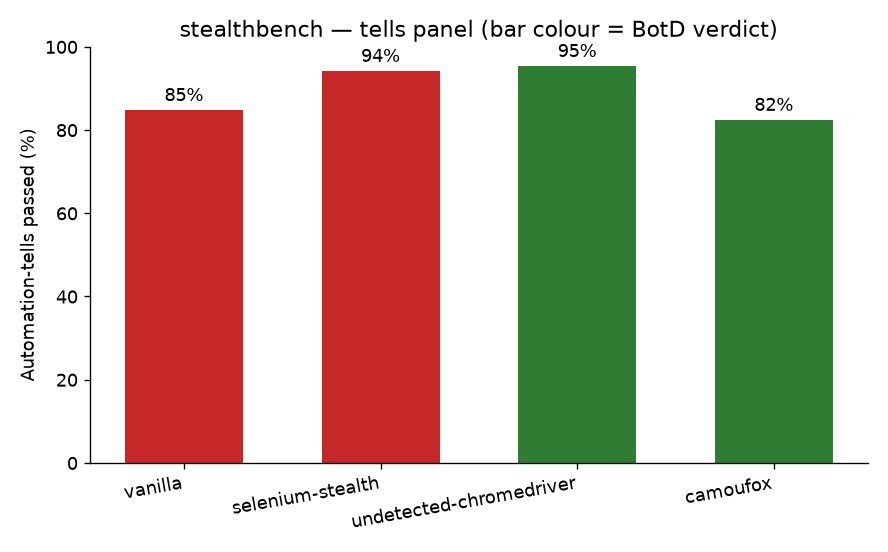
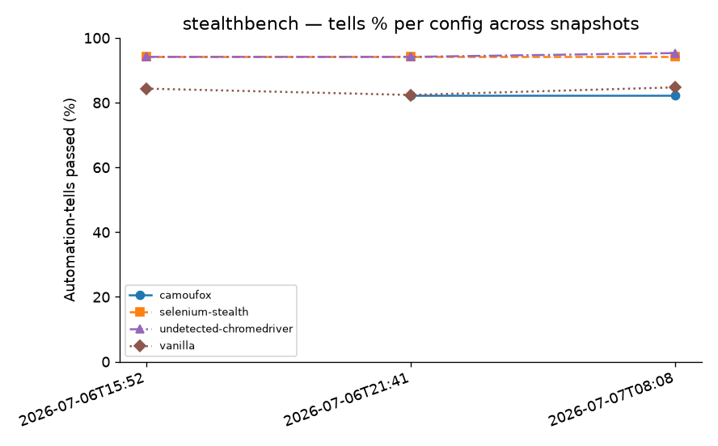

# stealthbench

**A reproducible benchmark that puts _numbers_ on browser-automation stealth.**


stealthbench scores stealth **configs** (how you set up an automated browser) against
open, self-hosted **detectors** (how a site decides you're a bot), and emits a
versioned results file plus a regenerable report. It measures *detectability* — it
never extracts anyone's data, and every detector runs on your own `localhost`.

The point is simple: instead of arguing about which automation setup is "stealthier,"
run all of them through the same detectors on the same machine and read the numbers.

## Latest snapshot

Chrome 149 + Camoufox · Linux · **10 trials** · `results/20260707T080815283159.json`

Tells % is `mean ± stdev [min–max]` across the 10 trials (schema v2 records the
per-trial spread; older v1 snapshots stay readable).

| Config | Automation-tells passed | BotD verdict | CreepJS local lies |
|---|:---:|:---:|:---:|
| vanilla (stock Selenium) | 85 ± 3 [82–88] | caught (selenium) | 0 |
| selenium-stealth | 94 ± 0 [94–94] | caught (selenium) | 2 |
| undetected-chromedriver | 95 ± 2 [94–100] | **passed** | 0 |
| camoufox (stealth Firefox) | 82 ± 0 [82–82] | **passed** | 0 |

Versions: Selenium 4.45.0 · selenium-stealth 1.0.6 · undetected-chromedriver 3.5.5 ·
Playwright 1.59.0 · Camoufox 0.4.11.



Tells % per config across committed snapshots (trend over time):



> `camoufox` passes BotD and CreepJS while scoring 82% on the tells panel — the three
> tells it "fails" are Chrome-specific (`window.chrome` present, Chrome's `productSub`,
> Chrome's `eval.toString().length`), which a genuine Firefox legitimately does not
> match. That's the honest signal, not a regression.

> **This is a snapshot, not a benchmark leaderboard.** These are the numbers from *one*
> environment on *one* day, run from a single IP. Detection evolves; a config that passes
> today can be caught next week. The value here is the **method and the reproducibility**,
> not the specific percentages — and every number above traces to a committed
> `results/*.json`.

## Scope & ethics

These techniques are for **legitimate automation and testing**: QA of your own web
apps, monitoring sites you operate, accessibility auditing, and research. To keep that
boundary concrete, stealthbench is built so it *can't* be pointed at someone else's
service as an attack tool:

- **Detectors are self-hosted on `localhost`** — nothing hammers a third party's
  anti-bot service, and the benchmark works fully offline.
- **Results are numbers only.** No IPs, no raw fingerprints, no page content is ever
  persisted. CreepJS contributes only its *local lie count* (its trust score needs
  CreepJS's own API, which a self-hosted copy can't reach).
- **It measures detectability; it never extracts data.** There is no crawler, no login,
  no target site in this codebase.

## How it works

A run is the cross-product **configs × detectors × trials**:

**Configs** (a stealth setup that builds a browser):

| Config | What it is |
|---|---|
| `vanilla` | Stock Selenium Chrome — the baseline. |
| `selenium-stealth` | Selenium + [`selenium-stealth`](https://pypi.org/project/selenium-stealth/) patches (webdriver flag, languages, vendor, WebGL, UA). |
| `undetected-chromedriver` | [`undetected-chromedriver`](https://pypi.org/project/undetected-chromedriver/), pinned to the installed Chrome major. |
| `camoufox` | [Camoufox](https://github.com/daijro/camoufox) — a stealth **Firefox** driven through Playwright's sync API, fingerprint-spoofed by default. The one non-Chrome arm in the fleet. |

**Detectors** (measure signals from a browser, return numbers):

| Detector | Signal |
|---|---|
| **tells panel** | A transparent panel of ~17 individual automation/fingerprint checks (`navigator.webdriver`, CDC props, WebGL hardware, plugin/mimetype counts, UA, permissions consistency, …). Reports `passed` / `total`. |
| **BotD** | [`@fingerprintjs/botd`](https://github.com/fingerprintjs/BotD) — returns whether it thinks you're a bot and, if so, which kind (`selenium`, `headless_chrome`, …). |
| **CreepJS** | A self-hosted copy of [CreepJS](https://github.com/abrahamjuliot/creepjs) — contributes its count of detected *lies* (fingerprint inconsistencies). |

The orchestrator runs each config through each detector for N trials, isolating errors
so one flaky detector or config can't abort the run, and folds everything into a typed,
versioned `BenchResult`. The report layer renders a markdown table + bar chart from that
result file.

## Architecture

The design rests on two `Protocol` seams that meet at a driver-agnostic `BrowserHandle`:

```
Config.build() ─┐                          ┌─ Detector.measure(handle)
                ├──▶  BrowserHandle  ◀──────┤
 (imports a       (goto / evaluate / quit)    (depends only on the
  driver SDK)                                   BrowserHandle Protocol)
                          │
                          ▼
        run_bench(configs, detectors, metadata) ──▶ BenchResult ──▶ report
             (pure, error-isolating)                 (versioned)     (table + chart)
```

- **Detectors are written against `BrowserHandle`, not a raw driver.** The
  Camoufox/Playwright arm is exactly this: a new `Config` (`CamoufoxConfig`) plus a new
  `BrowserHandle` (`PlaywrightHandle`, adapting a Playwright `Page`) — added with
  **zero detector changes**.
- **Provider seam is enforced:** only `src/stealthbench/configs/` imports a driver SDK
  (`selenium` / `selenium-stealth` / `undetected-chromedriver` / `camoufox` +
  `playwright`). Everything else — `core/`, `runner.py`, `report.py`, and every detector
  — depends only on the Protocols. A test (`tests/test_seam.py`) fails the build if a
  browser SDK is imported anywhere outside `configs/`.
- **The pure core is unit-tested with fakes** (no browser required); the browser-touching
  configs and detectors are validated by the end-to-end run.

## Install

Requires **Python 3.12+**, [uv](https://docs.astral.sh/uv/), a real **Chrome/Chromium**,
and **Node.js** (to serve the BotD bundle). The `camoufox` config additionally uses a
patched stealth **Firefox**, fetched once via `camoufox fetch` (below).

```bash
git clone https://github.com/bessavagner/stealthbench.git
cd stealthbench
uv sync

# one-time: download Camoufox's patched Firefox (like `npm ci` for the BotD bundle)
uv run camoufox fetch
```

## Run a benchmark

stealthbench talks to two local detector servers. Bring them up, then run the bench:

```bash
# 0. one-time after `uv sync`: download Camoufox's patched Firefox
#    (like `npm ci` for the BotD bundle) — needed for the `camoufox` config
uv run camoufox fetch

# 1. tells panel + BotD on :8901  (the BotD bundle is vendored via package-lock.json)
( cd src/stealthbench/detectors/assets && npm ci && python3 -m http.server 8901 ) &

# 2. CreepJS on :8902  (prebuilt bundle, no build step)
git clone --depth 1 https://github.com/abrahamjuliot/creepjs.git /tmp/creepjs
( cd /tmp/creepjs/docs && python3 -m http.server 8902 ) &

# 3. run the benchmark (headful; needs a display)
uv run python -m stealthbench --trials 3
```

This writes a fresh `results/<timestamp>.json`, a `results/summary.md` table, and a
`results/pass-rate.png` chart, and prints the summary. Options:

```
--trials N            number of trials (default 3)
--detector-host URL   tells + BotD host (default http://localhost:8901)
--creep-host  URL     CreepJS host        (default http://localhost:8902)
```

> Runs are **headful** by design (a headless browser is itself a strong tell). On a
> headless machine, run behind a virtual display such as `Xvfb`.

## Regenerating the snapshot

The published numbers are reproducible. To regenerate `results/` from scratch:

1. **Prerequisites:** Python 3.12+, [uv](https://docs.astral.sh/uv/), a real
   Chrome/Chromium, and Node.js. Run `uv sync` once, then fetch Camoufox's patched
   Firefox once (needed for the `camoufox` config): `uv run camoufox fetch`.
2. **tells + BotD server** (`:8901`):
   `( cd src/stealthbench/detectors/assets && npm ci && python3 -m http.server 8901 ) &`
3. **CreepJS server** (`:8902`):
   `git clone --depth 1 https://github.com/abrahamjuliot/creepjs.git /tmp/creepjs && ( cd /tmp/creepjs/docs && python3 -m http.server 8902 ) &`
4. **Run the bench (headful):** `uv run python -m stealthbench --trials 3`
5. **On a headless machine:** the bench is headful by design (a headless browser
   is itself a strong tell), so it needs a display. Wrap the run instead of
   trying to force headless: `xvfb-run -a uv run python -m stealthbench --trials 3`.
6. **Commit the regenerated artifacts** for traceability: the new
   `results/<timestamp>.json`, `results/summary.md`, `results/pass-rate.png`, and
   the updated `results/trend.png`.

A headful CI workflow (running this under Xvfb on GitHub-hosted runners) is
intentionally deferred to a future pull — for now, reproduce locally via the
steps above.

## Project layout

```
src/stealthbench/
├── core/            # BrowserHandle / Config / Detector Protocols + wait_until + BenchResult schema
├── configs/         # SeleniumHandle + PlaywrightHandle + vanilla / stealth / uc / camoufox  (the ONLY driver-SDK importers)
├── detectors/       # tells / botd / creepjs  (+ self-hosted HTML assets)
├── runner.py        # run_bench: configs × detectors × trials, error-isolating
├── report.py        # summarize() + render_chart() from a results file
└── __main__.py      # CLI: python -m stealthbench
tests/               # pure-core unit tests (fakes; no browser) + detector contract tests
results/             # committed benchmark snapshots (json + summary.md + chart)
```

## Development

```bash
uv run pytest -q        # unit + detector-contract tests (no browser needed)
uv run ruff check .     # lint
```

The pure layers (core, runner, report, detector contracts) are test-driven and run
without a browser. Detectors **raise** on an invalid/failed signal so the runner records
an explicit error and the report shows `n/a` — a detector failure can never silently
masquerade as a stealth pass.

## Reproducibility

Every published figure is traceable: the CLI writes the raw `BenchResult` to
`results/<timestamp>.json`, and `summarize()` derives the table purely from it, so any
number can be recomputed from the committed data. Results are versioned
(`schema_version`) so older snapshots stay readable as the schema grows.

## Roadmap

The stealth-Firefox (Camoufox/Playwright) config arm has landed. More detectors, a
headful CI workflow, and packaging are planned. The backlog and per-sprint plans
are tracked privately and aren't published in this repo.

## Acknowledgements

Built on the open detectors it measures against —
[BotD](https://github.com/fingerprintjs/BotD) by FingerprintJS and
[CreepJS](https://github.com/abrahamjuliot/creepjs) by Abraham Juliot — both self-hosted
here so nothing touches their live services.

## License

[MIT](LICENSE) © Vagner Bessa. The self-hosted detectors it measures against keep
their own licenses (see the vendored bundles under `src/stealthbench/detectors/assets/`).
